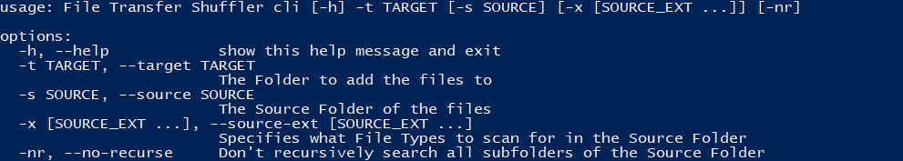
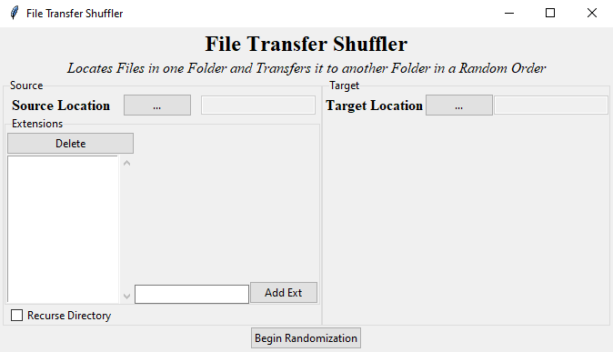

# File Transfer Shuffler
 Gathers Files, Shuffles Them, Prepends them with an Index Number, and Copies them to a Target Directory

## Requirements
* Python 3.8+

This utiltiy was built exclusively with builtin modules which means it has no dependencies and therefore can be used without any setup.

## Usage
Invoke using the commandline via whatever python command you have available (e.g.- `python filetransfershuffler.py`) and pass in either `cli` for using the Commandline Interface or `gui` for using the Graphical Interface.

## `cli`

## `gui`

---

### Usage Notes
* In both modes not providing Extensions will result in all files within the Source directory (and subdirectories if Recurse is active) will be transfered.
* Recurse is selected by default in both Modes. Using the Commandline Interface, pass the `-nr` flag to prevent recursion; in the Graphical Interface simply uncheck the `Recurse Directory` box.
* In the Graphical Interface there are popup windows displaying the Progress of the Program while it is Gathering and Randomizing/Copying files, but in most cases these processes are completed nearly instantaneously, so you may not see the Progress Window display anything other than "Done"